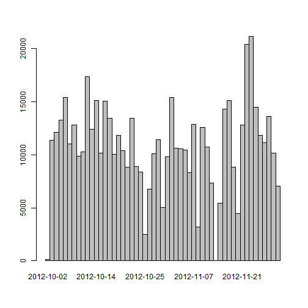
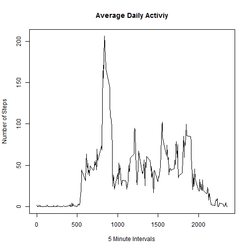
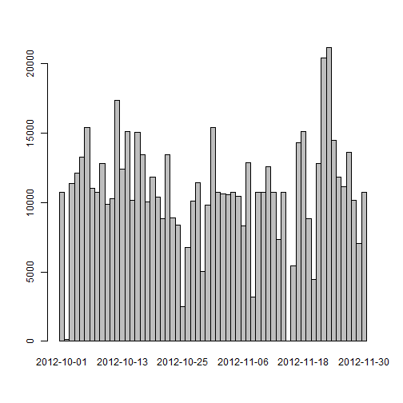

# Reproducible Research - Peer Assessment 1

## Loading and preprocessing the data

Load the required libraries and then create two different data sets, one with the NA values included and one without. 

```r
library(dplyr)
```

```
## 
## Attaching package: 'dplyr'
## 
## The following objects are masked from 'package:stats':
## 
##     filter, lag
## 
## The following objects are masked from 'package:base':
## 
##     intersect, setdiff, setequal, union
```

```r
library(lattice)
stepsDF_NA = read.csv("activity.csv")
stepsDF_NA = tbl_df(stepsDF_NA)
stepsDF = na.omit(stepsDF_NA)
```

## Mean, Median, Sum of Steps taken per day

Create a new data frame that contains the mean of the steps by date, then creating a barplot formatted to be presented as a histogram. Then the final table shows the mean, meadian, and sum by date.

```r
sumSteps = aggregate(steps ~ date, data = stepsDF, FUN = sum)
barplot(sumSteps$steps,names.arg=sumSteps$date,space=0)
```

 

```r
stepsDF %>% group_by(date) %>% summarise(Mean=mean(steps), Median=median(steps), Sum=sum(steps))
```

```
## Source: local data frame [53 x 4]
## 
##          date     Mean Median   Sum
##        (fctr)    (dbl)  (dbl) (int)
## 1  2012-10-02  0.43750      0   126
## 2  2012-10-03 39.41667      0 11352
## 3  2012-10-04 42.06944      0 12116
## 4  2012-10-05 46.15972      0 13294
## 5  2012-10-06 53.54167      0 15420
## 6  2012-10-07 38.24653      0 11015
## 7  2012-10-09 44.48264      0 12811
## 8  2012-10-10 34.37500      0  9900
## 9  2012-10-11 35.77778      0 10304
## 10 2012-10-12 60.35417      0 17382
## ..        ...      ...    ...   ...
```

## Average Daily Activity Pattern

Create a new data frame that contains the mean of steps by interval and then plot them as a time series

```r
averageSteps = aggregate(steps ~ interval, data = stepsDF, FUN = mean)
plot(averageSteps$interval,averageSteps$steps, type="l", xlab="5 Minute Intervals", ylab="Number of Steps", main="Average Daily Activiy")
```

 

### The interval with the max average number of steps starts at 835 minutes and goes to 840 minutes

## Imputing Missing Values

First, count the number of NAs in the data set (2304). Then replace the NA values with the mean of average steps for the interval missing the data. Next create another barplot formatted as a histogram to present the data. Finally provide a table of the mean, median, and sum of the data set with the NAs replaced with imputed values.

```r
countNAs = sum(is.na(stepsDF_NA$steps))
print(countNAs)
```

```
## [1] 2304
```

```r
stepsDF_NA_Replaced = stepsDF_NA
stepsDF_NA_Replaced$steps[is.na(stepsDF_NA_Replaced$steps) & stepsDF_NA_Replaced$interval == averageSteps$interval] = averageSteps$steps
sumSteps_NA_Replaced = aggregate(steps ~ date, data = stepsDF_NA_Replaced, FUN = sum)
barplot(sumSteps_NA_Replaced$steps,names.arg=sumSteps_NA_Replaced$date,space=0)
```

 

```r
stepsDF_NA_Replaced %>% group_by(date) %>% summarise(Mean=mean(steps), Median=median(steps), Sum=sum(steps))
```

```
## Source: local data frame [61 x 4]
## 
##          date     Mean   Median      Sum
##        (fctr)    (dbl)    (dbl)    (dbl)
## 1  2012-10-01 37.38260 34.11321 10766.19
## 2  2012-10-02  0.43750  0.00000   126.00
## 3  2012-10-03 39.41667  0.00000 11352.00
## 4  2012-10-04 42.06944  0.00000 12116.00
## 5  2012-10-05 46.15972  0.00000 13294.00
## 6  2012-10-06 53.54167  0.00000 15420.00
## 7  2012-10-07 38.24653  0.00000 11015.00
## 8  2012-10-08 37.38260 34.11321 10766.19
## 9  2012-10-09 44.48264  0.00000 12811.00
## 10 2012-10-10 34.37500  0.00000  9900.00
## ..        ...      ...      ...      ...
```
### The impact of imputing missing data on the estimates of the total daily number of steps is that there are now more days that are charted. However, for those days that were already charted, the values have not changed.

## Differences in Activity Patterns Between Weekdays and Weekends

Add two new columsn to the data frame, the first to determine the day of the week and the second to calculate whether it is a weekday or weekend. Calculate the mean of the steps over the interval and type of day, then present it as a two row lattice panel plot

```r
stepsDF_NA_Replaced$weekday = weekdays(as.Date(stepsDF_NA_Replaced$date))
myWeekend = c("Saturday","Sunday")
myWeekdays = c("Monday","Tuesday","Wednesday","Thursday","Friday")
stepsDF_NA_Replaced$typeofday[stepsDF_NA_Replaced$weekday %in% myWeekend] = "weekend"
stepsDF_NA_Replaced$typeofday[stepsDF_NA_Replaced$weekday %in% myWeekdays] = "weekday"
averageSteps_NA_Replaced = aggregate(steps ~ interval * typeofday, data = stepsDF_NA_Replaced, FUN = mean)
xyplot(steps ~ interval | typeofday, data=averageSteps_NA_Replaced, layout=c(1,2),type="l")
```

 
